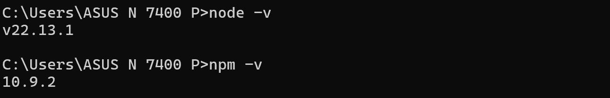
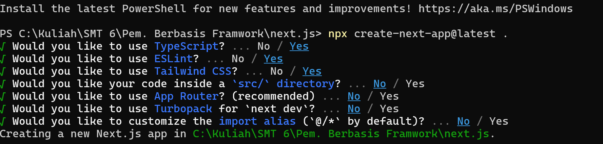
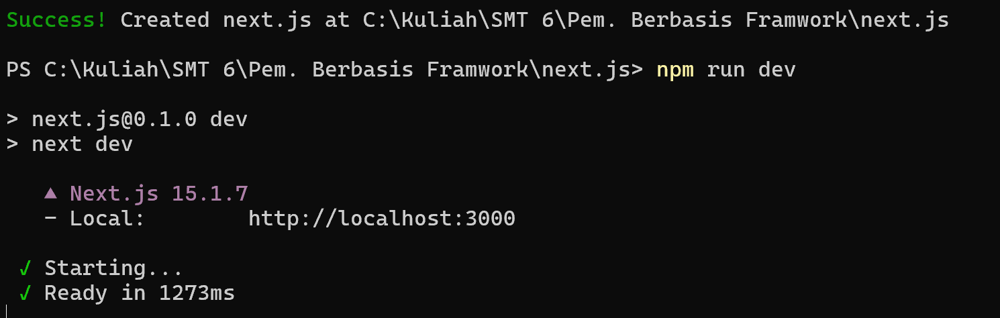
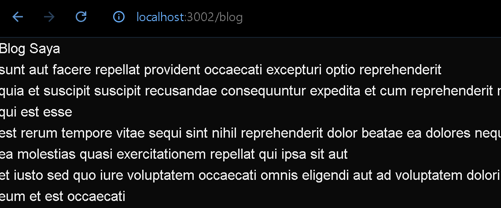
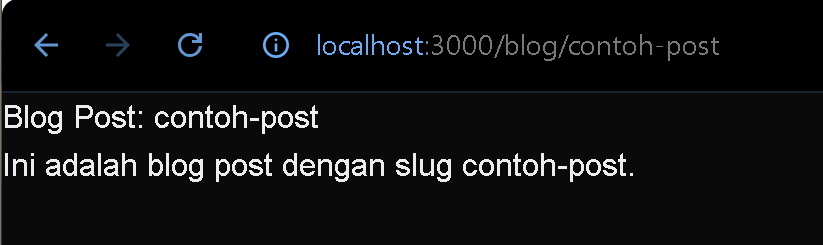
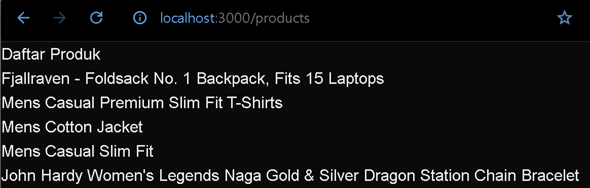
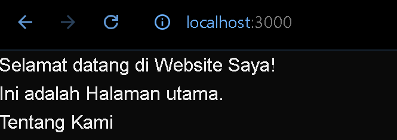
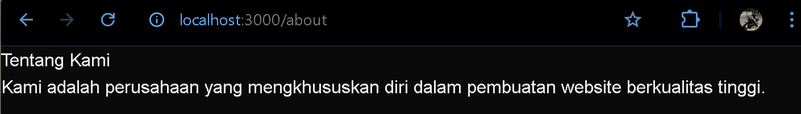
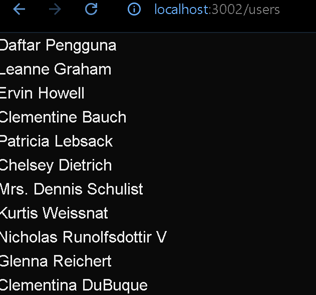
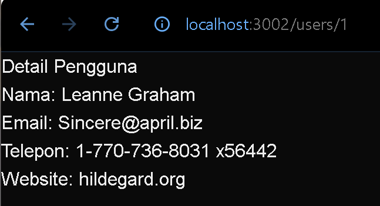

This is a [Next.js](https://nextjs.org) project bootstrapped with [`create-next-app`](https://nextjs.org/docs/pages/api-reference/create-next-app).

## Kinata Dewa Ariandi <br> TI 3C <br> 2241720087

### Langkah 1
1. Pastikan Node.js dan npm sudah terinstal di komputer Anda. Anda dapat memeriksanya dengan menjalankan perintah berikut di terminal atau command prompt:

2. Buat direktori baru untuk proyek Next.js Anda
-   sudah
3. Inisialisasi proyek Next.js dengan menjalankan perintah berikut: Perhatikan bahwa App Router belum digunakan

4. Jalankan aplikasi Next.js dengan perintah:


---

### Langkah 2
```jsx
import React from "react";

const HomePage = () => {
  return (
    <div>
      <h1>Selamat datang di  Website Saya!</h1>
      <p>Ini adalah Halaman utama.</p>
    </div>
  );
};

export default HomePage;
```

Hasil : 


---

### Langkah 3

```jsx
import React from "react";

const Blog = ({ post }) => {
    return (
        <div>
            <h1>Blog Saya</h1>
            {post.map((post) => (
                <div key={post.id}>
                    <h2>{post.title}</h2>
                    <p>{post.body}</p>
                </div>
            ))}
        </div>
    );
};

export async function getStaticProps() {
    const res = await fetch('https://jsonplaceholder.typicode.com/posts');
    const post = await res.json();

    return {
        props: { post }, 
    };
}

export default Blog;

```

Hasil : 


---
### Langkah 4
```jsx
import { useRouter } from "next/router";

const BlogPost = () => {
    const router = useRouter();
    const { slug } = router.query;

    return (
        <div>
            <h1>Blog Post: {slug}</h1>
            <p>Ini adalah blog post dengan slug {slug}.</p>
        </div>
    );
};

export default BlogPost;
```

Hasil : 


---
### Langkah 5

```jsx
import { useState, useEffect } from "react";

const ProductList = () => {
    const [products, setProducts] = useState([]);

    useEffect(() => {
        const fetchProducts = async () => {
            const response = await fetch('/api/products');
            const products = await response.json();
            setProducts(products);
        };

        fetchProducts();
    }, []);

    return (
        <div>
            <h1>Daftar Produk</h1>
            <ul>
                {products.map((products) => (
                    <li key={products.id}>{products.title}</li>
                ))}
            </ul>
        </div>
    );
};

export default ProductList;
```
Hasil : 


---
### Langkah 6
Index.js : 
```jsx
import Link from "next/link";

const HomePage = () => {
  return (
    <div>
      <h1>Selamat datang di  Website Saya!</h1>
      <p>Ini adalah Halaman utama.</p>
      <Link href='/about'>
        Tentang Kami
      </Link>
    </div>
  );
};

export default HomePage;
```

Hasil : 


About.js : 
```jsx
const AboutPage = () => {
    return (
        <div>
            <h1>Tentang Kami</h1>
            <p>Kami adalah perusahaan yang mengkhususkan diri dalam pembuatan website berkualitas tinggi.</p>
        </div>
    );
};

export default AboutPage;
```

Hasil : 


---
### Tugas
1. Hasil : 


2. Hasil : 


3. Hasil : 
